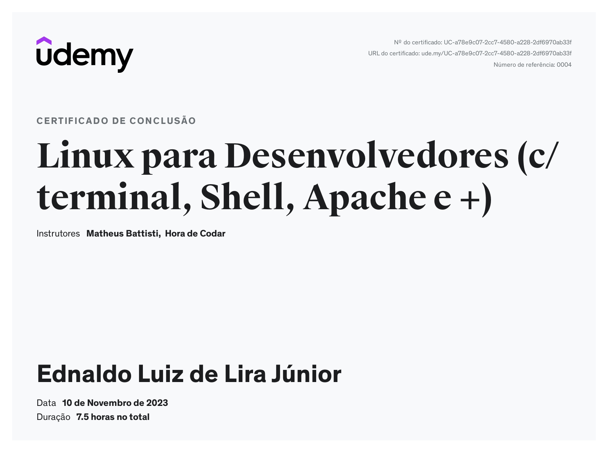
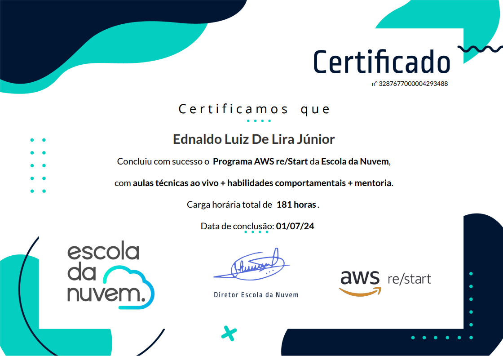
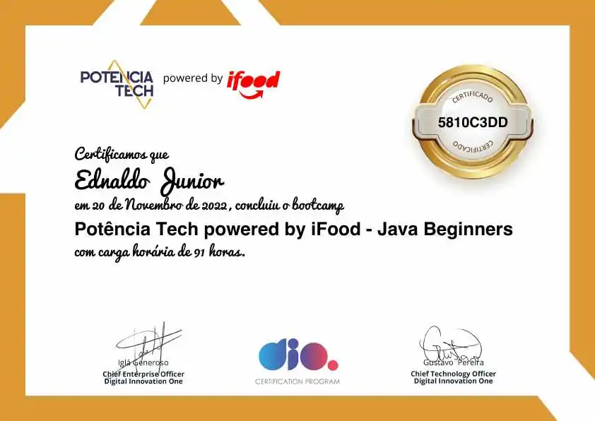
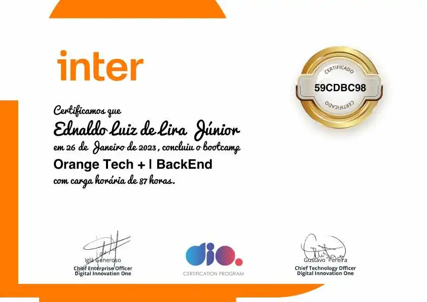
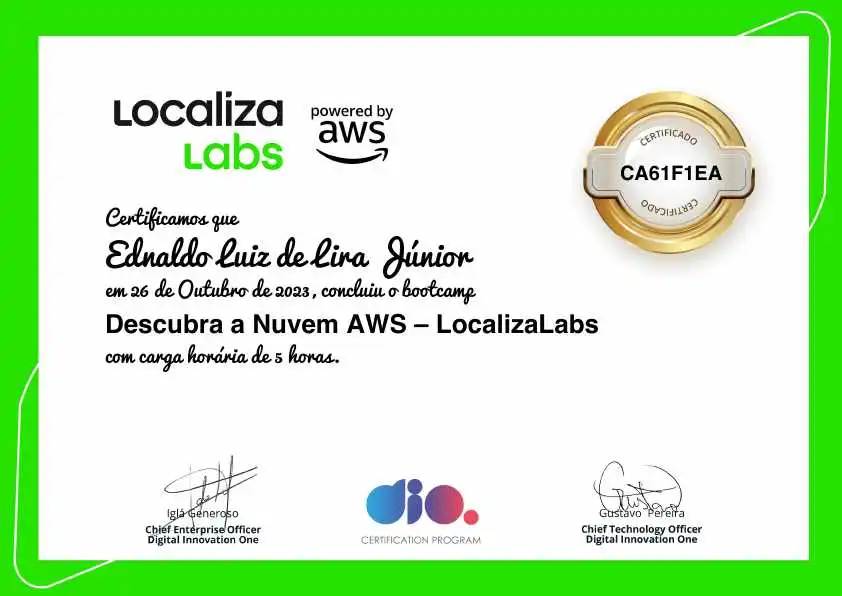
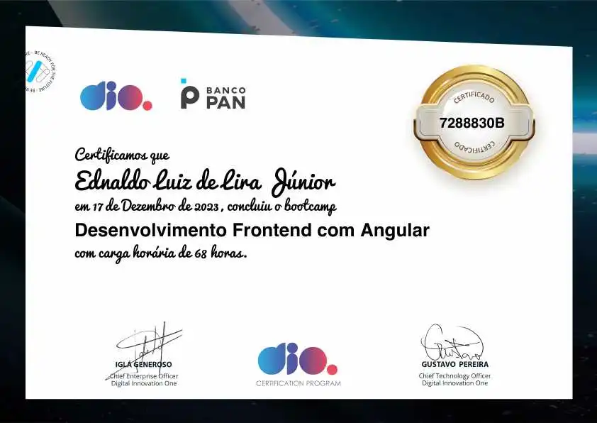

  <h1>Meus Certificados</h1>

## Outros

- [Badges Credly](https://www.credly.com/users/ednaldo-luiz/edit/badges#credly)

## Índice

- [Cursos](#cursos)
  - [Back-end](#backend)
    - [Alura](#backend-alura)
    - [AlgaWorks](#backend-algaworks)
  - [Front-end](#frontend)
    - [Alura](#frontend-alura)
    - [Rocketseat](#frontend-rocketseat)
  - [IA](#ia)
  - [DevOps](#devops)
  - [AWS](#aws)
    - [Escola da Nuvem](#escola-da-nuvem)
    - [Método ADVC](#método-advc)
  - [Outros](#outros)
    - [UltraCursos](#ultra-cursos)
- [Bootcamps](#bootcamps)
- [Certificações](#certificações)

---

  <h1 id="cursos">Cursos</h1>

### Back-end ⚙️

  <h3 id="backend-alura">Alura</h3>
  
  
  
  
  
  
  

  <h3 id="backend-algaworks">AlgaWorks</h3>
  

---

### Front-end 💻

  <h3 id="frontend-alura">Alura</h3>
  
  
  
  
  
  
  
  

  <h3 id="frontend-rocketseat">Rocketseat</h3>
  <!-- Ainda sem certificados, mas slot pronto -->
  
Em breve 🚀

---

### DevOps ♾️

  <h3 id="devops-alura">Alura</h3>
  
  
  
  
  
  

 <h3 id="devops-alura">Udemy</h3>
  
  

---

### IA 

  

---

### AWS ☁️

  <h3 id="escola-da-nuvem">Escola da Nuvem</h3>
  

  <h3 id="método-advc">Método ADVC</h3>
  
  

---

### Outros 🛠️

  <h3 id="ultra-cursos">Ultra Cursos</h3>
  
  
  <!-- 
   -->

---

  <h1 id="bootcamps">Bootcamps 🚀</h1>

  
  
  
  
  
  

---

  <h1 id="certificações">Certificações 🎓</h1>

  
  

